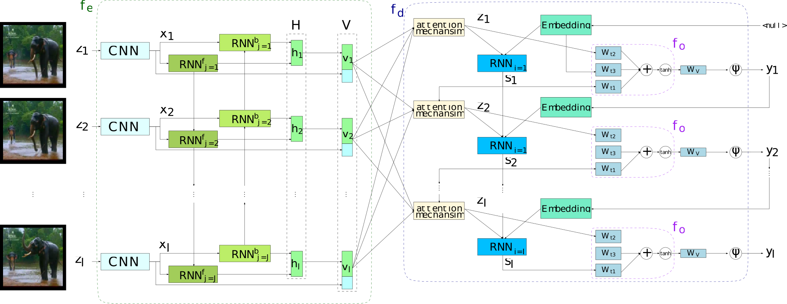

# Interactive Keras Captioning


[]()

Interactive multimedia captioning with Keras (Theano and Tensorflow). Given an input image or video, we describe its content.
 
## [Live demo here](http://casmacat.prhlt.upv.es/invc).


## Recurrent neural network model with attention


## Transformer model


## Interactive captioning

Interactive-predictive pattern recognition is a collaborative human-machine framework for obtaining high-quality predictions while minimizing the human effort spent during the process.

It consists in an iterative prediction-correction process: each time the user introduces a correction to a hypothesis, the system reacts offering an alternative, considering the user feedback. 

For further reading about this framework, please refer to [Interactive Neural Machine Translation](http://www.sciencedirect.com/science/article/pii/S0885230816301000), [Online Learning for Effort Reduction in Interactive Neural Machine Translation](https://arxiv.org/abs/1802.03594) and [Active Learning for Interactive Neural Machine Translation of Data Streams](https://arxiv.org/abs/1807.11243).
 
 
## Features (in addition to the full Keras cosmos): .

 * [Transformer model](https://arxiv.org/abs/1706.03762).
 * Support for GRU/LSTM networks:
   - Regular GRU/LSTM units.
   - [Conditional](https://arxiv.org/abs/1703.04357) GRU/LSTM units in the decoder.   
   - Multilayered residual GRU/LSTM networks (and their Conditional version).
 * Peeked decoder: The previously generated word is an input of the current timestep.
 * Online learning and Interactive-predictive correction.
 * Attention model over the input sequence (image or video).
   - Supporting [Bahdanau (Add)](https://arxiv.org/abs/1409.0473) [Luong (Dot)](https://arxiv.org/abs/1508.04025) attention mechanisms.
   - Also supports double stochastic attention (Eq. 14 from [arXiv:1502.03044](https://arxiv.org/pdf/1502.03044.pdf))
 * Beam search decoding.
 * Ensemble decoding ([caption.py](https://github.com/lvapeab/nmt-keras/blob/master/sample_ensemble.py)).
   - Featuring length and source coverage normalization ([reference](https://arxiv.org/abs/1609.08144)).
 * Model averaging ([utils/model_average.py](https://github.com/lvapeab/nmt-keras/blob/master/utils/average_models.py)).
 * [Label smoothing](https://arxiv.org/abs/1512.00567).  
 * N-best list generation (as byproduct of the beam search process).
 * Use of pretrained ([Glove](http://nlp.stanford.edu/projects/glove/) or [Word2Vec](https://code.google.com/archive/p/word2vec/)) word embedding vectors.
 * [Client-server](https://github.com/lvapeab/nmt-keras/tree/master/demo-web) architecture for web demos:
    - [Interactive NMT](https://github.com/lvapeab/nmt-keras/tree/interactive_NMT).
    - [Check out the demo!](http://casmacat.prhlt.upv.es/inmt)
    
    
## Installation

Assuming that you have [pip](https://en.wikipedia.org/wiki/Pip_(package_manager)) installed, run:
  
  ```bash
  git clone https://github.com/lvapeab/interactive-keras-captioning
  cd interactive-keras-captioning
  pip install -r requirements.txt
  ```
 
 for obtaining the required packages for running this library.
 

### Requirements

Interactive Keras Captioning requires the following libraries:

 - [Our version of Keras](https://github.com/MarcBS/keras) (Recommended release [2.2.4.2](https://github.com/MarcBS/keras/tree/2.2.4.2) or newer).
 - [Multimodal Keras Wrapper](https://github.com/lvapeab/multimodal_keras_wrapper/tree/Interactive_NMT) (Interactive_NMT branch).
 - [Coco-caption evaluation package](https://github.com/lvapeab/coco-caption/tree/master/pycocoevalcap/) (Only required to perform evaluation). This package requires `java` (version 1.8.0 or newer).


For accelerating the training and decoding on CUDA GPUs, you can optionally install:

 - [CuDNN](https://developer.nvidia.com/cudnn).
 - [CuPy](https://github.com/cupy/cupy).


## Usage

### Training
 1) Set a training configuration in the `config.py` script. Each parameter is commented. You can also specify the parameters when calling the `main.py` script following the syntax `Key=Value`

 2) Train!:

  ``
 python main.py
 ``


### Decoding
 Once we have our model trained, we can translate new text using the [caption.py](https://github.com/lvapeab/interactive-keras-captioning/blob/master/caption.py) script.
In short, if we want to use evaluate the test set from a the dataset `MSVD` with an ensemble of two models, we should run something like:
 ```bash
  python caption.py 
              --models trained_models/epoch_1 \ 
                       trained_models/epoch_2 \
              --dataset datasets/Dataset_MSVD.pkl \
              --splits test
  ```
 

### Acknowledgement


This library is strongly based on [NMT-Keras](https://github.com/lvapeab/nmt-keras). Much of the library has been developed together with [Marc Bolaños](https://github.com/MarcBS) ([web page](http://www.ub.edu/cvub/marcbolanos/)) for other sequence-to-sequence problems. 

To see other projects following the same philosophy and style of Interactive Keras Captioning, take a look to:

[NMT-Keras: Neural Machine Translation](https://github.com/lvapeab/nmt-keras).

[ABiViRNet: Video description](https://github.com/lvapeab/ABiViRNet).

[TMA: Egocentric captioning based on temporally-linked sequences](https://github.com/MarcBS/TMA).

[VIBIKNet: Visual question answering](https://github.com/MarcBS/VIBIKNet).

[Sentence SelectioNN: Sentence classification and selection](https://github.com/lvapeab/sentence-selectioNN).

[DeepQuest: State-of-the-art models for multi-level Quality Estimation](https://github.com/sheffieldnlp/deepQuest).


### Warning!

There is a [known issue](https://github.com/Theano/Theano/issues/5994) with the `Theano` backend. When running `main.py` with this backend, it will show the following message:

```
[...]
raise theano.gof.InconsistencyError("Trying to reintroduce a removed node")
InconsistencyError: Trying to reintroduce a removed node
```

It is not a critical error, the model keeps working and it is safe to ignore it. However, if you want the message to be gone, use the Theano flag `optimizer_excluding=scanOp_pushout_output`.


## Contact

Álvaro Peris ([web page](http://lvapeab.github.io/)): lvapeab@prhlt.upv.es 

